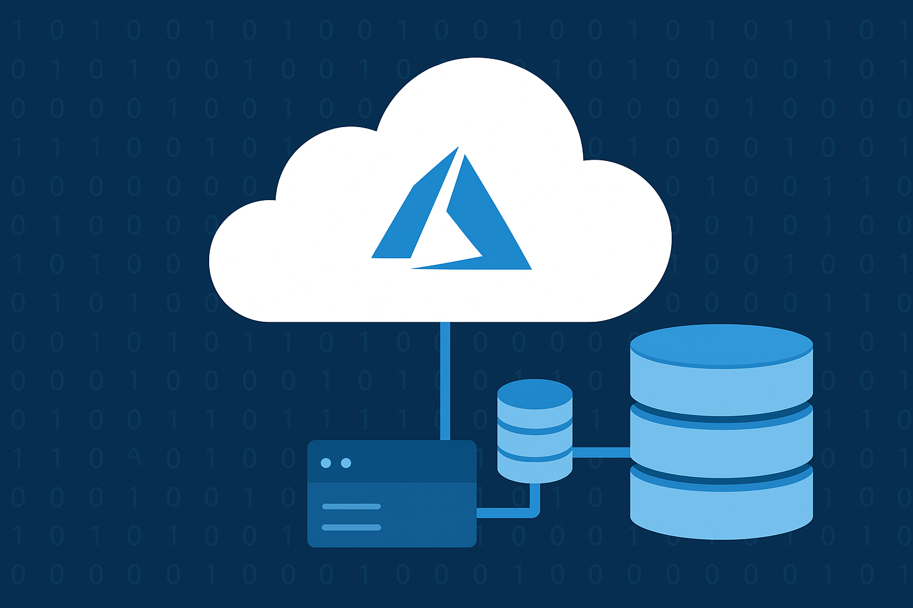

<!-- Banner -->

  

<h1 align="center">🗄️ Configurando uma Instância de Banco de Dados no Microsoft Azure</h1>

  
  
  

---

## 📘 Objetivo do Laboratório

Este laboratório tem como objetivo **praticar o processo de configuração de uma instância de Banco de Dados** na plataforma **Microsoft Azure**.  
Como entregável, o desafio consiste em **criar um repositório no GitHub** contendo:

- 🧾 **Resumos** sobre os conceitos de bancos de dados no Azure;  
- 🛠️ **Anotações** sobre as etapas de configuração;  
- 💡 **Dicas práticas** para uso e otimização;  
- 📚 **Referências** para estudo e consulta futura.

O resultado final será um **material de apoio para estudos** e futuras implementações em projetos reais.

---

## 🧭 Sumário

1. [Introdução ao Azure SQL Database](#-introdução-ao-azure-sql-database)  
2. [Criando uma Instância de Banco de Dados no Portal do Azure](#-criando-uma-instância-de-banco-de-dados-no-portal-do-azure)  
3. [Configurando Firewall e Acesso Seguro](#-configurando-firewall-e-acesso-seguro)  
4. [Conectando ao Banco de Dados via SQL Server Management Studio (SSMS)](#-conectando-ao-banco-de-dados-via-sql-server-management-studio-ssms)  
5. [Boas Práticas de Gerenciamento e Escalabilidade](#-boas-práticas-de-gerenciamento-e-escalabilidade)  
6. [Limpando Recursos e Gerenciando Custos](#-limpando-recursos-e-gerenciando-custos)  
7. [Dicas e Anotações de Estudo](#-dicas-e-anotações-de-estudo)  
8. [Referências](#-referências)

---

## 🧩 Introdução ao Azure SQL Database

O **Azure SQL Database** é um serviço de banco de dados relacional totalmente gerenciado na nuvem, baseado no **Microsoft SQL Server**.  
Ele oferece alta disponibilidade, backup automatizado, escalabilidade sob demanda e segurança integrada, sem necessidade de manutenção de hardware.

---

## ⚙️ Criando uma Instância de Banco de Dados no Portal do Azure

1. Acesse o [Portal do Azure](https://portal.azure.com).  
2. Pesquise por **"SQL Database"** e clique em **Criar**.  
3. Selecione o **grupo de recursos** e insira um nome para o banco.  
4. Crie um **servidor lógico** com nome, login e senha de administrador.  
5. Escolha o **tipo de computação e armazenamento** conforme a demanda (DTU ou vCore).  
6. Clique em **Revisar + Criar** e, depois, em **Criar**.

Após a implantação, o banco de dados estará disponível com um **endpoint público** para conexão.

---

## 🔐 Configurando Firewall e Acesso Seguro

1. Vá até o recurso do banco criado.  
2. Clique em **Configurações de firewall e rede virtual**.  
3. Adicione o **endereço IP do seu computador** para permitir o acesso.  
4. (Opcional) Configure **Azure Active Directory** para autenticação corporativa.  

🔒 **Dica:** Nunca abra o acesso para “0.0.0.0 – 255.255.255.255” em produção.

---

## 🧠 Conectando ao Banco de Dados via SQL Server Management Studio (SSMS)

1. Abra o **SQL Server Management Studio (SSMS)**.  
2. No campo **Server name**, insira o **nome do servidor lógico** (exemplo: `meuservidor.database.windows.net`).  
3. Faça login com as credenciais definidas.  
4. Após conectar, você pode criar tabelas, executar consultas e importar dados.

💡 **Dica:** Utilize **Azure Data Studio** como alternativa multiplataforma ao SSMS.

---

## 🚀 Boas Práticas de Gerenciamento e Escalabilidade

- Use **camadas elásticas** para compartilhar recursos entre múltiplos bancos.  
- Configure **alertas de desempenho** e **diagnósticos automáticos**.  
- Automatize backups e **geo-replicação** para alta disponibilidade.  
- Utilize **auto-scale** e **políticas de custo** para otimizar o uso de recursos.

---

## 🧹 Limpando Recursos e Gerenciando Custos

1. Vá até o **Grupo de Recursos**.  
2. Clique em **Excluir grupo de recursos** para remover todos os itens associados.  
3. Confirme a exclusão para evitar custos desnecessários.  

💰 **Dica:** Sempre habilite **alertas de orçamento** no Azure Cost Management.

---

## 🧾 Dicas e Anotações de Estudo

- 💡 **Anote comandos SQL úteis**, como `CREATE DATABASE`, `SELECT`, `BACKUP`, etc.  
- 🧠 **Registre aprendizados** sobre segurança e performance.  
- 🧰 **Liste ferramentas de apoio** como SSMS, Azure CLI e Data Studio.  
- 📘 **Salve tutoriais úteis** da documentação oficial.  

---

## 📚 Referências

- [Documentação Oficial do Azure SQL Database](https://learn.microsoft.com/pt-br/azure/azure-sql/database/)  
- [Azure Portal - Criar Banco de Dados SQL](https://learn.microsoft.com/pt-br/azure/azure-sql/database/single-database-create-quickstart?tabs=azure-portal)  
- [Azure Cost Management](https://learn.microsoft.com/pt-br/azure/cost-management-billing/)  
- [Microsoft Learn - Roteiro de Treinamento SQL no Azure](https://learn.microsoft.com/pt-br/training/modules/)

---

🧑‍💻 **Autor:** [Roberto Emílio Mariano de Rezende](https://github.com/robertoemilio)  
📅 **Última atualização:** Outubro de 2025  
